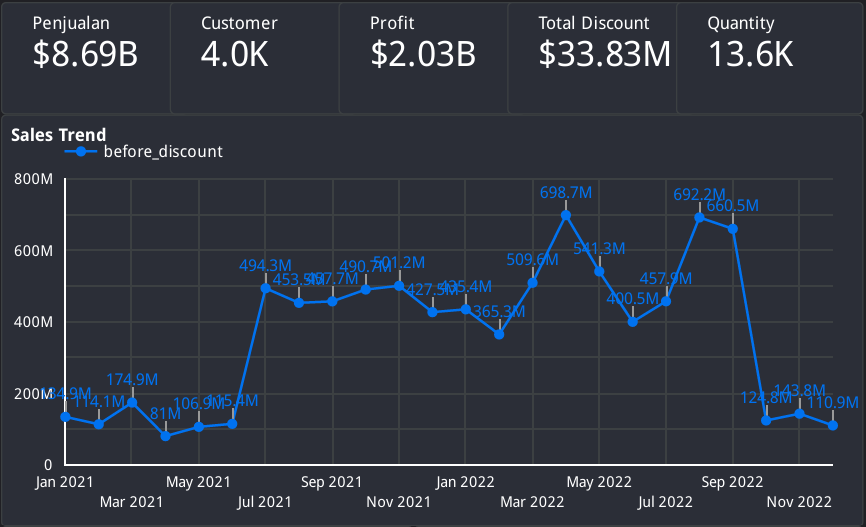
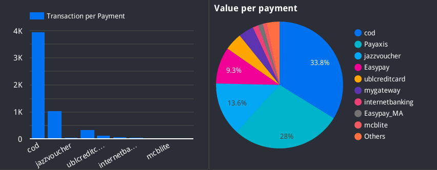
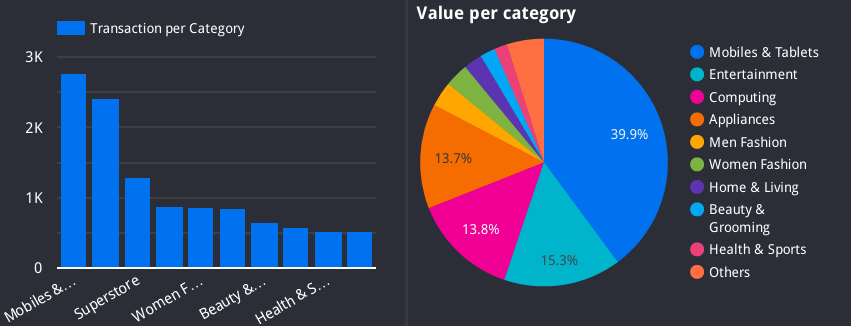
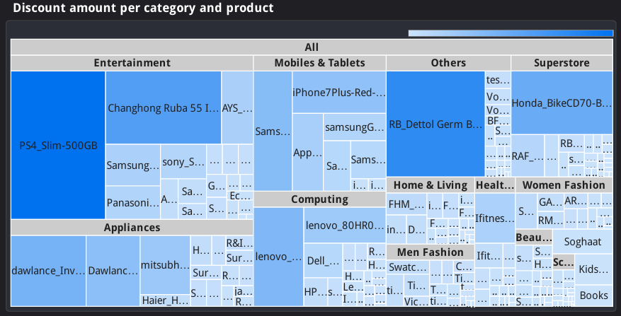
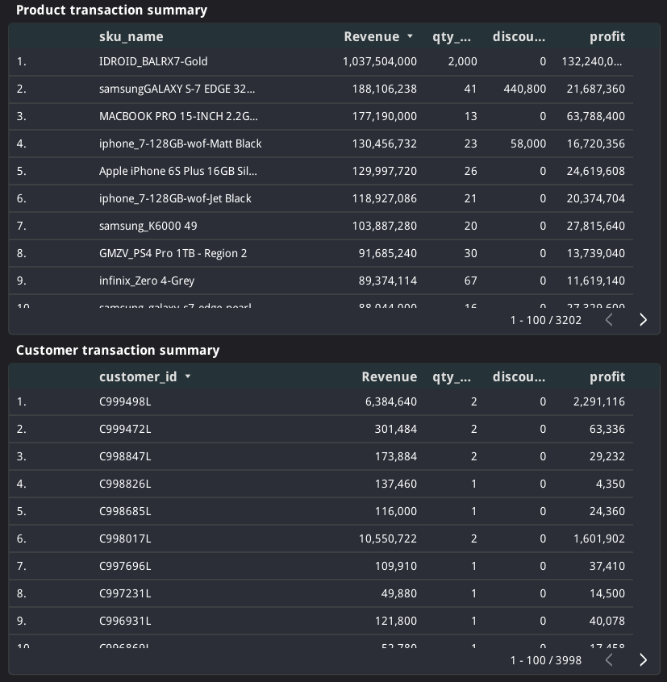
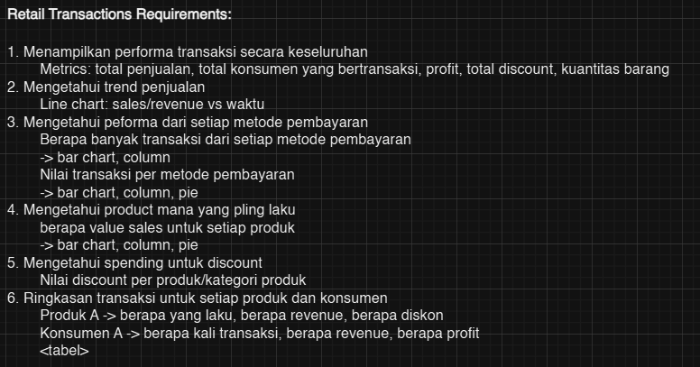
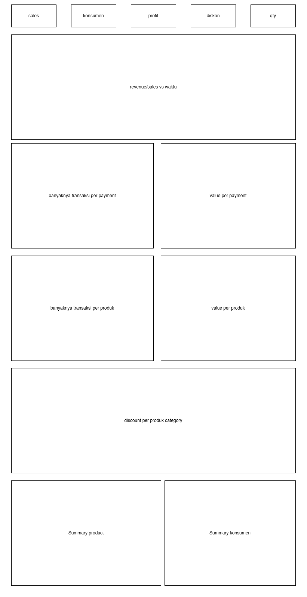
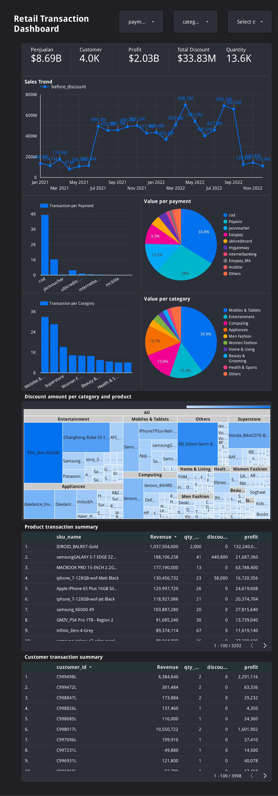

# Retail Transaction Dashboard
## Project Background
This dashboard is designed to provide comprehensive analysis of retail transaction performance through various visualizations and metrics, enabling data-drive decision-making.
Key features include:

**1. Overall Transaction Performance**

    

Metrics displayed: total sales, total customers, profit, total discount, and product quantity sold.

**2. Sales Trend Overtime**

    

Line charts and pie charts to showcase revenue trends over specific time periods for identifying patterns and seasonal influences.

**3. Payment Method Performance**

    

Transaction counts by payment method line charts.
Transaction values segmented by payment method pie charts.

**4. Top-selling products & Discount Spending**

    

Sales value per product displayed in bar/column/pie charts to highlight best-performing items. Discount values analyzed by product or product category.

**5. Transaction Summaries**

    

Detailed tables summarizing performance by product and customer:
Product-level data: units sold, revenue, discount amounts.
Customer-level data: transaction frequency, revenue, profit contribution.

>

## Requirements
I detailed the requirements from product manager as follows.

    

### Mockup created before executing 

    

## Dashboard

    

## Conclusion
The retail transactions dashboard provides a comprehensive overview of key performance metrics, including total sales, customer transactions, profit, discounts, and product quantities, enabling a clear understanding of overall business performance. With detailed trend analysis through time-based revenue visualizations, businesses can identify sales patterns and seasonal impacts. Insights into payment method performance highlight transaction volumes and values, while product-level analyses reveal top-selling items and their contribution to revenue. Additionally, the dashboard uncovers discount spending efficiency across products and categories, ensuring cost-effective promotions. Summaries of customer and product transactions offer granular insights into purchasing behaviors and profitability, empowering businesses to make data-driven decisions to enhance operational efficiency and drive growth.
